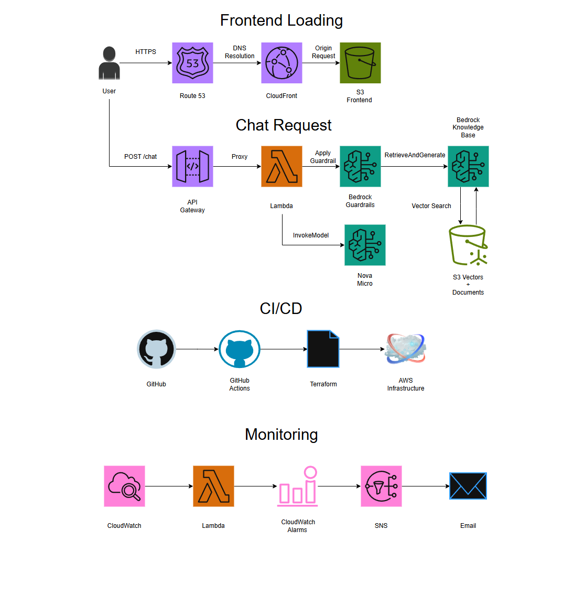

# HeartBot — AI-Powered Cardiac Health Assistant

> A fully serverless RAG chatbot built on AWS that helps users understand heart health. Live at [askheartbot.com](https://askheartbot.com)

## Architecture



## Overview

HeartBot is a serverless RAG AI cardiac chatbot fully hosted on AWS. It helps users understand their cardiac health, it can answer questions about heart attack symptoms, hypertension, lifestyle changes, and other cardiovascular topics. It allows for a centralized way to get grounded, citation-backed information without having to search several different sources because it retrieves information from vetted health content and generates responses using Amazon Nova Micro with AI safety guardrails to ensure medically responsible answers. I built this project out of a genuine interest in healthcare technology and to demonstrate end-to-end cloud engineering on a real, deployed product.

## Tech Stack

| Layer | Technology |
|---|---|
| Frontend | React |
| CDN | Amazon CloudFront |
| DNS | Amazon Route 53 |
| API | Amazon API Gateway |
| Compute | AWS Lambda (Python 3.12) |
| LLM | Amazon Nova Micro |
| Knowledge Base | Amazon Bedrock Knowledge Bases |
| Embeddings | Amazon Titan Embeddings V2 |
| Vector Store | Amazon S3 Vectors |
| Storage | Amazon S3 |
| AI Safety | Amazon Bedrock Guardrails |
| IaC | Terraform |
| CI/CD | GitHub Actions |
| Monitoring | Amazon CloudWatch + SNS |

## Key Design Decisions

**Origin Access Control**
For the frontend hosting, I chose CloudFront with Origin Access Control over making the S3 bucket publicly accessible. OAC signs every request between CloudFront and S3 using AWS Signature Version 4, this ensures that the bucket is never accessible publicly. I chose OAC over the older Origin Access Identity because it's more secure, is the recommended AWS approach, and supports all the S3 features including KMS Encryption. 

**RAG Pipeline**
For the prompting and response generation, I chose to use a RAG pipeline over pure prompting. RAG or Retrieval Augmented Generation pulls information from a dedicated knowledge base that contains cited and sourced documentation about a specific topic. Compared to pure prompting, which uses the model itself to generate responses or searching the web, RAG allows for the response to use primary information that provides the best experience for users. Since HeartBot is a healthcare project, it has to provide the most accurate information. RAG allows for that as I can provide it a knowledge base of accurate information.

**Remote Terraform State**
For the deployment, I chose to have a remote Terraform state. I chose this over having a local state because it will protect the state from alteration locally and it will allow for the state to be fetched to other computers if I have collaborators on the project. The backend uses S3's native lockfile to prevent concurrent applies, ensuring the infrastructure is never modified by two processes simultaneously. 

**Two-Layer AI Safety**
I used a two-layer AI safety approach by using Bedrock Guardrails for PII filtering and prompt engineering in the Lambda to restrict off-topic questions. I needed the guardrails to ensure that sensitive information could not be displayed by the model. This ensures things like SSN, phone numbers, and email remain anonymous whenever HeartBot generates a response. I needed to have the prompt engineering to ensure that HeartBot does not provide invalid information like diagnosis for users and only uses the information from the knowledge base. This makes sure that HeartBot only provides general information about a specific cardiac issue rather than diagnosing a user with a condition.

## Features

- Answers questions about heart attack symptoms, warning signs, and when to seek emergency care
- Offers cited information about cardiac health
- Provides ways to improve lifestyle to better your cardiac health
- Answers questions about hypertension, warning signs, and when to seek emergency care
- Offers information about warning signs of worsening heart health
- Contains guidelines that ensure users get only recommended, cited information rather than a diagnosis
- Filters personal information from responses to protect user privacy
- Displays source references alongside responses so users can verify information

## Infrastructure

Terraform manages the deployment of the entire infrastructure of this project. It creates all of the S3 buckets, CloudFront Distributions, Lambda Function, API Gateway, Bedrock Guardrails and Knowledge Base Configurations, IAM Policies, and CloudWatch Dashboard. It creates the bucket policies as well as widgets for CloudWatch, ensuring that the entire chatbot can come online and be operational in a very short time as compared to having to manually configure everything through the AWS Console. All infrastructure state is stored remotely in S3 with native lockfile support to prevent concurrent modifications.

## CI/CD

Frontend Pipeline
- The Frontend Pipeline focused on using GitHub actions goes through a series of actions whenever there are changes to made in any files in the frontend. It goes through the steps of configuring AWS credentials, setting up Node.js, install dependencies, build, deploying to S3, and invalidating the CloudFront cache. This ensures that the code changes pushed to the repo do not create any errors or issues with the current deployment. 

Terraform Pipeline
- The Terraform Pipeline also focused on using GitHub actions goes through a series of actions whenever there are changes made in any files in the terraform folder. The steps that this pipeline follows are configuring the AWS credentials, setting up terraform, running terraform init, doing a terraform format check, running terraform validate, terraform plan runs on PRs and posts as a comment, and terraform apply only runs on merge to main. This ensures the new code changes don't create issues with the current deployment.

## Setup & Deployment

### Prerequisites
- Terraform >= 1.5.0
- AWS CLI configured with credentials (`aws configure`)
- Node.js 20+
- AWS account with Amazon Bedrock access enabled for:
  - `amazon.nova-micro-v1:0`
  - `amazon.titan-embed-text-v2:0`

---

### 1. Clone the repository
```bash
git clone https://github.com/abaig32/HeartBot.git
cd HeartBot
```

---

### 2. Deploy AWS infrastructure
```bash
cd terraform
cp terraform.tfvars.example terraform.tfvars
# Edit terraform.tfvars with your alarm_email and any other settings
terraform init
terraform plan
terraform apply
```

After `apply` completes, note the outputs — you will need `api_gateway_url` and `knowledge_base_id`.

---

### 3. Upload knowledge base documents
```bash
aws s3 sync path/to/your/documents/ s3://$(terraform output -raw s3_knowledge_base_bucket)/ --region us-east-1
```

---

### 4. Trigger knowledge base ingestion
```bash
aws bedrock-agent start-ingestion-job \
  --knowledge-base-id $(terraform output -raw knowledge_base_id) \
  --data-source-id $(terraform output -raw knowledge_base_data_source_id) \
  --region us-east-1
```

Check ingestion status:
```bash
aws bedrock-agent list-ingestion-jobs \
  --knowledge-base-id $(terraform output -raw knowledge_base_id) \
  --data-source-id $(terraform output -raw knowledge_base_data_source_id) \
  --region us-east-1
```

Wait until status shows `COMPLETE` before proceeding.

---

### 5. Configure and deploy the frontend
```bash
cd ../frontend
echo "VITE_API_URL=$(cd ../terraform && terraform output -raw api_gateway_url)" > .env
npm install
npm run build
aws s3 sync dist/ s3://$(cd ../terraform && terraform output -raw s3_knowledge_base_bucket | sed 's/knowledge-base/frontend/')/ \
  --delete \
  --cache-control "public, max-age=31536000, immutable"
```

Invalidate the CloudFront cache:
```bash
aws cloudfront create-invalidation \
  --distribution-id <your-distribution-id> \
  --paths "/*"
```

---

### 6. Access the application

Visit [https://askheartbot.com](https://askheartbot.com) or your own domain if self-hosting.

---

## Disclaimer

HeartBot is for informational purposes only and is not a substitute for professional medical advice, diagnosis, or treatment. Always consult a qualified healthcare provider for medical concerns.